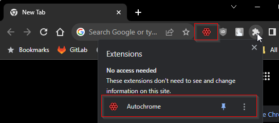
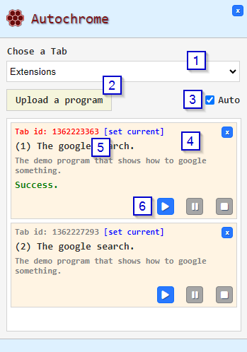

# Autochrome Documentation
1. [Basic usage](#BasicUsage)
2. [Creating a program](#CreatingAProgram)
   - [Structure](#Structure)
   - [Actions](#Actions)

## Basic usage <a name="BasicUsage"></a>
### Chrome extension icon
To use the plugin just open its popup window by clicking on the icon  



### The popup window
The popup window is the window where you can upload and run the programs.



#### [1] Dropdown list with all Chrome Tabs
The Dropdown list contains all Chrome Tabs, the selected Tab will be assigned to the program being uploaded.

#### [2] The "Upload a program" button
Click on this button and choose the program to be uploaded to the plugin. The chosen Tab will be assigned to the selected program, and it will appear in the list of the programs.
If the earlier assigned Tab is not currently available (was closed) then the 'Tab id' will be red, and you can press **[set current]** link to assign the current tab to the program.

#### [3] The "Auto" checkbox
Turn this checkbox on if you want all programs to be executed automatically one by one. If this checkbox is turned off then only the program you've started will be executed, but if you turn the checkbox on, then the next program in the list will start executing after the previous one is finished.

#### [4] The Program panel
This panel contains the name and the description of the program as well as information about the current state and action buttons.
Each program contains action buttons: Play, Pause, and Stop. If the program has been successfully executed the green **Success** status will be displayed. If any error occurs then the error message will be displayed in red.

#### [5] Tab id
If the Tab ID is in red then it means that the Chrome Tab that was assigned to the program is currently closed, press **[set current]** to assign the tab that is currently selected in the 'Chose a Tab' drop-down list.
If the Tab ID is in gray color then the Tab is available and the program can be started in this Tab.

#### [6] Action buttons
- Play - start current program. Note that if the "Auto" checkbox is switched on then the next program in the list will automatically start after the current one is finished.
- Pause - pause execution of the current program, hit 'Play' to resume.
- Stop - stop executing all programs.

## Creating a program <a name="CreatingAProgram"></a>
### Structure <a name="Structure"></a>
The program is the **.json** file that contains instructions for the Content script. All instructions are the named actions and are executed one by one, if any action is failed then the program stops executing and displays the error in the popup window. Note that some actions may suppress the error, so the program will continue executing even if an error occurs.

This is an example of the program:
``` json
{
  "name": "The Youtube search.",
  "description": "The demo program that shows how to search on Youtube.",
  "version": 1,
  "rootAction": {
    "name": "AutoActionRoot",
    "description": "The starting point.",
    "children": [
      {
        "name": "AutoActionUrl",
        "description": "Go to YouTube.com",
        "url": "https://youtube.com"
      },
      {
        "name": "AutoActionWait",
        "description": "Wait a little so you can click on the page to close the popup and give the page all focus it needs.",
        "timeToWait": 2000
      },
      {
        "name": "AutoActionFocus",
        "description": "Focus the search input.",
        "selector": "input#search",
        "smoothMouse": true
      },
      {
        "name": "AutoActionWait",
        "description": "Wait a little so you can see where the cursor is.",
        "timeToWait": 1000
      },
      {
        "name": "AutoActionEnterText",
        "description": "Enter the search text",
        "selector": "input#search",
        "text": "Gods of software"
      },
      {
        "name": "AutoActionWait",
        "description": "Wait a little so you can notice the entered text.",
        "timeToWait": 1000
      },
      {
        "name": "AutoActionClick",
        "description": "Click on the search button.",
        "selector": "#search-icon-legacy",
        "smoothMouse": true,
        "wait": false
      },
      {
        "name": "AutoActionWait",
        "description": "Wait until all found elements are loaded.",
        "timeToWait": 1000
      },
      {
        "name": "AutoActionClick",
        "description": "Click on the Gods of Software channel.",
        "selector": "a[href=\"/@godsofsoftware\"]#main-link",
        "smoothMouse": true,
        "wait": true,
        "timeout": 10000
      }
    ]
  }
}
```

The root **name** and **description** fields will be displayed on the popup window in the program panel. The **version** is for the future migration of the programs with a lower version, set it to 1 for now.

The **rootAction** field contains mandatory [root action](AutoActionRoot), it is a starting point where the **children** field contains an array of all program actions. All actions are executed one by one, but it is possible to transit to the specific action using dedicated actions like [AutoActionCase](#AutoActionCase). Note that each action may have its own children set in the **children** field, all actions from the children will be executed one by one and then return to the main parent children sequence. You may use this feature to group the actions.

Each **action** contains basic fields that are described in the **IAutoAction** interface and implemented in the **AutoAction** class.

#### [**AutoAction**](#AutoAction) implements IAutoAction <a name="AutoAction"></a>

- **id?: string** - optional field, if not set it will be automatically populated by the internal id, the value is only required if you intend to make a transition to this **action** from the other **action**, if so then you have to provide the specific id
- **name: AutoActionName** - mandatory field, the name of the action, it is required for the program parser to understand what exact command is this
- **description?: string** - optional field, the description of the command, will be displayed at runtime inside the program panel on the plugin popup window above the progress bar
- **continueAfterFail?: boolean** - optional field, the default value is **false**, so the program stops execution if any error occurs while invoking this action. If set to **true** then the program will continue execution from the next action even if an error occurs
- **timeout?: number** - optional field, the default value is 60000 milliseconds, it may be changed in the **Config** settings. This value is used to fail the **action** if it is executing more than the **timeout** value, for example, if an action waits for some element in the DOM model but the element is absent and nobody is going to create it
- **children?: IAutoAction[]** - optional field, the array of the child actions

#### [**IQuerySelectorWithParameters**](#IQuerySelectorWithParameters) <a name="IQuerySelectorWithParameters"></a>

The **Autochrome** project is based on the [css selector](https://www.w3schools.com/cssref/css_selectors.php), almost all actions are applied to some HTML Element that is found by the specified **Selector**. The [css selector](https://www.w3schools.com/cssref/css_selectors.php) is a very powerful thing, but we've added our own class to make a selection of the **HTML Elements** a little bit easier for the users.
For example, it lets search by the **innerText** or the **textContent** and also select children (which is a daunting task if we want to accomplish this by the single **scc selector** string).
##### Properties
- **selector: string** - [css selector](https://www.w3schools.com/cssref/css_selectors.php)
- **innerText?: string** - optional field, have to be the valid [RegExp](https://developer.mozilla.org/en-US/docs/Web/JavaScript/Reference/Global_Objects/RegExp) string (without slashes), if set then the selector engine will test the RegExp with the selected **Element.**[innerText](https://developer.mozilla.org/en-US/docs/Web/API/HTMLElement/innerText) property and return the **Element** only if the test result is true
- **textContent?: string** - optional field, have to be the valid [RegExp](https://developer.mozilla.org/en-US/docs/Web/JavaScript/Reference/Global_Objects/RegExp) string (without slashes), if set then the selector engine will test the RegExp with the selected **Element.**[textContent](https://developer.mozilla.org/en-US/docs/Web/API/Node/textContent) property and return the **Element** only if the test result is true
- **all?: boolean** - optional field, the default value is **false**, if set to **true** then all **Elements** found by the selector will be returned, otherwise only the first **Element**
- **child?: string | [IQuerySelectorWithParameters](#IQuerySelectorWithParameters)** - optional field, the nested IQuerySelectorWithParameters that if specified then will apply the **Selector** to the **Element** found by the previous **Selector** and return the result

### Actions <a name="Actions"></a>

Below you can find the description of all **actions** that are currently implemented.

- [AutoActionRoot](#AutoActionRoot)
- [AutoActionCase](#AutoActionCase)
- [AutoActionCheck](#AutoActionCheck)
- [AutoActionClick](#AutoActionClick)
- [AutoActionEnterText](#AutoActionEnterText)
- [AutoActionFocus](#AutoActionFocus)
- [AutoActionScrollIntoView](#AutoActionScrollIntoView)
- [AutoActionSelectFile](#AutoActionSelectFile)
- [AutoActionSetValue](#AutoActionSetValue)
- [AutoActionUrl](#AutoActionUrl)
- [AutoActionWait](#AutoActionWait)
- [AutoActionWaitUntil](#AutoActionWaitUntil)

#### **[AutoActionRoot](#AutoActionRoot)** extends [AutoAction](#AutoAction) <a name="AutoActionRoot"></a>

This is a root action that must be specified in the program for the field **rootAction**. It is only used to hold all the program actions inside the array of the **children's** field.

#### **[AutoActionCase](#AutoActionCase)** extends [AutoAction](#AutoAction) <a name="AutoActionCase"></a>
The **AutoActionCase** step uses the **selector** as a condition to choose what the next step has to be. If the **selector** returns at least one element then the next step will be the step with ID specified in the **thenActionId** field, otherwise, the next step will be **elseActionId**.
##### Properties
- **selector: string | [IQuerySelectorWithParameters](#IQuerySelector)**
- **wait?: boolean** - <a name="WaitDescription"></a> optional field, the default value is **false**, indicates should the step wait until the selector returns some element? It is possible that at the time the step is invoked the desired element isn't yet created in the DOM model, so it is useful to wait until it is. So if the **wait** property  is **true** the Step will wait until the Element appears or throw an exception after the timeout. If the **wait** is **false** then the Element must already be in the DOM model at the time the Step is invoked otherwise an error is thrown
- **thenActionId: string** - ID of the next step from which program execution will continue if the **selector* finds at least one element
- **elseActionId: string** - if the **selector** doesn't find any element then the program execution will continue from the step with this ID.

#### **[AutoActionCheck](#AutoActionCheck)** extends [AutoAction](#AutoAction) <a name="AutoActionCheck"></a>

Checks if the **Element** specified by the **selector** exists or not exists in the DOM. The type of check is controlled by the **'type'** field, and for example if the **'type'** is 'NotExists' and the selector returned a null **Element** then the action result will be **'Success'** otherwise if the **Element** was found then the action result will be **'Failed'**.

##### Properties
- **selector: string | [IQuerySelectorWithParameters](#IQuerySelector)** - may return one or more **Elements**, the action checks if at least one element is selected, so it can be one or many.
- **wait?: boolean** - optional field, the default value is **false**, indicates should the step wait until the selector returns some element? See the extended description [here](#WaitDescription)
- **type: IAutoActionCheckType** - the type of check, may be 'Exists or 'NotExists', so it checks whether the selected element exists or not exists in the DOM accordingly.
- **silent?: boolean** - optional field, the default value is **false**. If set to **true** then in case of the failed check the exception will not be thrown (only the result will be set to **false**). It is required when the Check Action is used inside the **AutoActionCheckGroup**, so we may group different checks and compare them without failing on the first false check.
- **highlight?: boolean** - optional field, the default value is **false**. If true then the selected element's background will be changed to the green color (can be useful if you want to see what element was currently checked)

#### **[AutoActionCheckGroup](#AutoActionCheckGroup)** extends [AutoAction](#AutoAction) <a name="AutoActionCheckGroup"></a>

Groups a number of **Checks** by the 'OR' or 'AND' conditions and returns overall result.

##### Properties
- **operator: IAutoActionGroupOperator** - have to be **'And'** or **'Or'**. This operator works as a standard comparing operator, if it is **'And'** then all **Checks** must be true so the group result to be true, if the operator is **'Or'** then at least on **Check** should be true to make the whole group true.
- **checkItems: (IAutoActionCheckGroup | IAutoActionCheck)[]** - an array of **Checks**, note that you may use Check Groups inside the Groups to make quite complicated checks.
- **silent?: boolean** - optional field, the default value is **false**. If set to **true** then in case of the failed check the exception will not be thrown (only the result will be set to **false**). It is required when **the Check Group** is used inside the **AutoActionCheckGroup**, so we may group different checks and compare them without failing on the first false check.


#### **[AutoActionClick](#AutoActionClick)** extends [AutoAction](#AutoAction) <a name="AutoActionClick"></a>

Applies mouse click to the selected **element**

##### Properties
- **selector: string | [IQuerySelectorWithParameters](#IQuerySelector)** - note that if the selector returns more than one **Element** then the Click Action will click all of them.
- **wait?: boolean** - optional field, the default value is **false**, indicates should the step wait until the selector returns some element? See the extended description [here](#WaitDescription)
- **smoothMouse?: boolean** - optional field, the default value is **false**, if set to **true** then the mouse cursor will move smoothly toward the selected **Element**

#### **[AutoActionEnterText](#AutoActionEnterText)** extends [AutoAction](#AutoAction) <a name="AutoActionEnterText"></a>
The **AutoActionEnterText** step puts the specified text into the selected **Element**. This action takes the **text** and invokes the following sequence of events for each character of the string: **keydown** => **keypress** => **input** => **keyup** simulating the manual entering of the text.
##### Properties
- **selector: string | [IQuerySelectorWithParameters](#IQuerySelector)** - takes only the first **Element** if multiple **Elements** have been returned by the **selector**
- **text: string** - the string that will be put into the **Element** each character one by one simulating the following events: keydown -> keypress -> input -> keyup
- **wait?: boolean** - optional field, the default value is **false**, indicates should the step wait until the selector returns some element? See the extended description [here](#WaitDescription)
- **focusBefore?: boolean** - optional field, if **true** then before starting entering the text the **Element** will be focused.
- **blurAfter?: boolean** - optional field, if **true** then after the text has been entered the **Element** will be unfocused.

#### **[AutoActionFocus](#AutoActionFocus)** extends [AutoAction](#AutoAction) <a name="AutoActionFocus"></a>

Focuses the selected **element**. Simply calls the **.focus()** method of the selected **Element**.

##### Properties
- **selector: string | [IQuerySelectorWithParameters](#IQuerySelector)** - takes only the first **Element** if multiple **Elements** have been returned by the **selector**
- **wait?: boolean** - optional field, the default value is **false**, indicates should the step wait until the selector returns some element? See the extended description [here](#WaitDescription)
- **smoothMouse?: boolean** - optional field, the default value is **false**, if set to **true** then the mouse cursor will move smoothly toward the selected **Element**

#### **[AutoActionScrollIntoView](#AutoActionScrollIntoView)** extends [AutoAction](#AutoAction) <a name="AutoActionScrollIntoView"></a>

Scrolls the **element** such that it is visible to the user. Internally this **action** calls the scrollIntoView() method of the selected element, so you can see its description on the MDN for details. If many elements were selected the only first will be used for the scrolling.

##### Properties
- **selector: string | [IQuerySelectorWithParameters](#IQuerySelector)** - takes only the first **Element** if multiple **Elements** have been returned by the **selector**
- **wait?: boolean** - optional field, the default value is **false**, indicates should the step wait until the selector returns some element? See the extended description [here](#WaitDescription)
- **behavior : string** - Determines whether scrolling is instant or animates smoothly. Must take one of the following values: **'auto'**, **'instant'**, or **'smooth'**. Defaults to **'auto'**.
- **block : string** - Defines vertical alignment. One of **'start'**, **'center'**, **'end'**, or **'nearest'**. Defaults to **'start'**.
- **inline: string** - Defines horizontal alignment. One of **'start'**, **'center'**, **'end'**, or **'nearest'**. Defaults to **'nearest'**.

#### **[AutoActionSelectFile](#AutoActionSelectFile)** extends [AutoAction](#AutoAction) <a name="AutoActionSelectFile"></a>

Simulates the file selection for the **<input type="file""> element** chosen by the **selector**.

##### Properties
- **selector: string | [IQuerySelectorWithParameters](#IQuerySelector)** - takes only the first **Element** if multiple **Elements** have been returned by the **selector**. To work properly the **selector** must return the **HTMLInputElement**.
- **wait?: boolean** - optional field, the default value is **false**, indicates should the step wait until the selector returns some element? See the extended description [here](#WaitDescription)
- **fileName: string** - the name of the **file**
- **fileType: string** - the mime type of the **file**
- **fileContent: string** - the base64 encoded content of the **file**

#### **[AutoActionSetValue](#AutoActionSetValue)** extends [AutoAction](#AutoAction) <a name="AutoActionSetValue"></a>

Sets the value to the **Input element**. The **value** may be any static value, or it may be the [IAutoValue](#IAutoValue). The [IAutoValue](#IAutoValue) allows you to take value from another **element** and set it to the current **element**.

##### Properties
- **selector: string | [IQuerySelectorWithParameters](#IQuerySelector)** - takes only the first **Element** if multiple **Elements** have been returned by the **selector**. To work properly the **selector** must return the **HTMLInputElement**.
- **wait?: boolean** - optional field, the default value is **false**, indicates should the step wait until the selector returns some element? See the extended description [here](#WaitDescription)
- **value: any | [IAutoValue](#IAutoValue) | [IParameterLink](#IParameterLink) ** - the value to be set to the **element** that has to be **HTMLInputElement**

#### **[IAutoValue](#IAutoValue)** <a name="IAutoValue"></a>

This is the interface to describe the value that will be taken from the **element** specified by the **selector**. After the **element** has been found the value from it will be returned for further processing. What exact value will be taken is depends on the **type** parameter that is self-descriptive, e.g. if you set the **'attribute'** the value of the attribute will be taken, if **'innerText'** then the **element.innerText** etc.

##### Properties
- **type: AutoValueType** - must be AutoValueTypeName which is **'AutoValue'**
- **selector: string | [IQuerySelectorWithParameters](#IQuerySelector)** - takes only the first **Element** if multiple **Elements** have been returned by the **selector**. To work properly the **selector** must return the **HTMLInputElement**.
- **wait?: boolean** - optional field, the default value is **false**, indicates should the step wait until the selector returns some element? See the extended description [here](#WaitDescription)
- **valueType: AutoValueSourceType** - may be one of the following items: **'attribute'**, **'innerText'**, **'textContent'**, **'innerHTML'**
- **attributeName: string** - specifies the name of the attribute from which the value will be taken if the value type is the **'attribute'**

#### **[AutoActionUrl](#AutoActionUrl)** <a name="AutoActionUrl"></a>

Sets the specified **URL** to the **document.location**. After this action is invoked the browser will reload the page and this means that the action's state will still be active because the **content** script (the script on the page) will not be able to send the successful result to the **background** script (the "server-side"). This is OK because the **background** script will get the event that the content script is starting, take the current active action (which is still **AutoActionUrl**), and continue with the next action, so the flow described in the program will not be broken.

##### Properties
- **url: string | [IAutoValue](#IAutoValue) | [IParameterLink](#IParameterLink)** - URL that will be set to the **document.location**

#### **[AutoActionWait](#AutoActionWait)** <a name="AutoActionWait"></a>

Pauses execution of the program for the specified number of milliseconds. Note that though in some cases it will be useful to just wait some specific amount of time, in many other cases when you want to wait until the DOM model updates it structure and some HTML Element appears you better use the [IQuerySelectorWithParameters](#IQuerySelector) and the **wait** parameter that is available in many actions.

##### Properties
- **timeToWait: number** - time to wait in milliseconds.


#### **[AutoActionWaitUntil](#IAutoActionWaitUntil)** <a name="AutoActionWaitUntil"></a>

Pauses the execution of the program until the **element** specified by the **selector** appears or disappears depending on the **untilType** parameter.

##### Properties
- **untilType: AutoActionWaitUntilType** - the **AutoActionWaitUntilType** defines the following values: **'appear'**, **'disappear'**
- **selector: IQuerySelectorWithParameters | string** - it doesn't matter how many **elements** are selected by the **selector** if the waiting type is **'appear'** then the **action** stops waiting if one or more **elements** are selected if the waiting time is **'disappear'** then the **action** stops waiting if 0 **elements** were selected.


